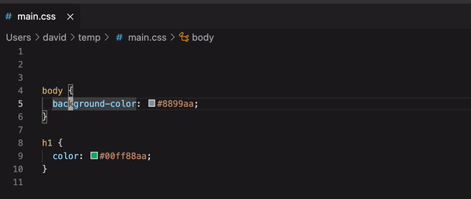

# hextorgb

## Features

Converts a hex code under the cursor to an rgb(a) string.

If the hexcode is 8 characters long the result will be an rgba string.

## Release Notes

### 0.0.1

Initial release
